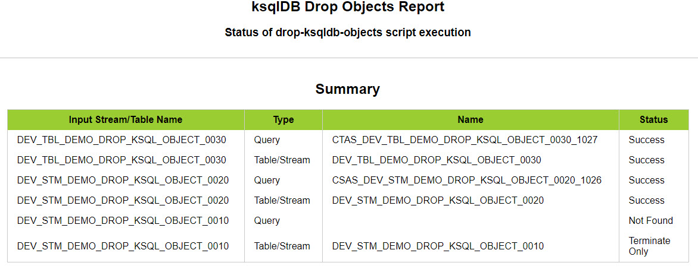
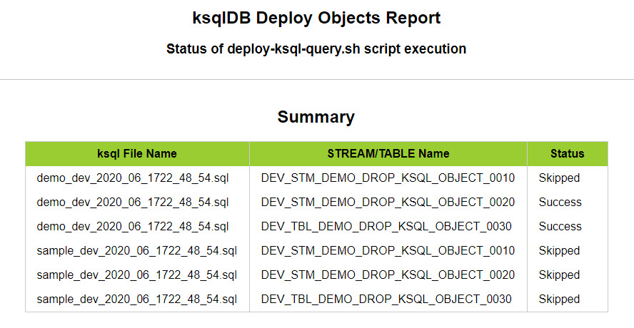

- [ksqlDB-utilities overview](#ksqldb-utilities-overview)
  - [Drop KSQL Objects](#drop-ksql-objects)
    - [Overview](#overview)
    - [How to execute this script](#how-to-execute-this-script)
      - [Step 01: Prepare input file](#step-01-prepare-input-file)
      - [Step 02: Execute the script](#step-02-execute-the-script)
      - [Step 03: Validating the results](#step-03-validating-the-results)
  - [Build KSQL Queries](#build-ksql-queries)
    - [Overview](#overview-1)
    - [How to execute this script](#how-to-execute-this-script-1)
      - [Step 01: Prepare control yaml](#step-01-prepare-control-yaml)
      - [Step 02: Prepare input file](#step-02-prepare-input-file)
      - [Step 03: Execute the script](#step-03-execute-the-script)
      - [Step 04: Validating the results](#step-04-validating-the-results)
  - [Deploy KSQL Queries](#deploy-ksql-queries)
    - [Overview](#overview-2)
    - [How to execute this script](#how-to-execute-this-script-2)
      - [Step 01: Prepare control yaml](#step-01-prepare-control-yaml-1)
      - [Step 02: Prepare input file](#step-02-prepare-input-file-1)
      - [Step 03: Execute the script](#step-03-execute-the-script-1)
      - [Step 04: Validating the results](#step-04-validating-the-results-1)

# ksqlDB-utilities overview
This repository has some utilities created for ksqlDB.

## Drop KSQL Objects
  
### Overview
Currently ksqlDB does not provide a way to terminate a query and to drop related stream/table and topics. This script is used to drop any ksql objects (streams, tables and queries).

### How to execute this script

#### Step 01: Prepare input file
Prepare input file, Input file should be of the format  
`<TABLE_STREAM_NAME>,<DELETE_TOPIC_FLAG>,<TERMINATE_ONLY_FLAG>`
  - TABLE_STREAM_NAME - Table OR Stream which you want to delete
  - DELETE_TOPIC_FLAG - Flag(Yes/No) to delete topic
  - TERMINATE_ONLY_FLAG - Flag(Yes/No) to terminate only and not drop objects

#### Step 02: Execute the script
Execute the script by running the command  
`./drop-ksqldb-objects.sh sed localhost:8088 /ksqldb-utilities/drop-ksqldb-objects/demo/DEMO_DROP_KSQL_OBJECT.dat`

 - `sed` is hardcoded value for now, in future this will be enhanced to use jq also
 - `localhost:8088` is the rest endpoint for your ksqlDB server
 - `ksqldb-utilities/drop-ksqldb-objects/demo/DEMO_DROP_KSQL_OBJECT.dat` is the path for the input file which was prepared in step 01.

#### Step 03: Validating the results
Script execution will generate a html report in `reports` sub directory of this script. This script will have information about the execution output.



## Build KSQL Queries
  
### Overview
This scripts runs a process to change the sql object names from one environment to another.

### How to execute this script

#### Step 01: Prepare control yaml
Prepare yaml file with an entry for each target environment. YAML file `build-ksqldb-query.yaml` should be placed in `input` sub directory of this script  and the contents should be in below format
```
dev:
  object:
    # Object Name(TABLE/STREAM) configuration
    before: ' LAB_'
    after: ' DEV_'
  topic:
    # Topic Name Configuration
    before: 'lab.'
    after: 'dev.'
```

#### Step 02: Prepare input file
Prepare input file (for example sample.dat) with list of sqls which should run thru build process during this execution. Input file should be in below format.
`/ksqldb-utilities/build-ksqldb-query/demo/demo.sql`

> Remember the contents inside the input file should be of `.sql` extension only and is case sensitive.

#### Step 03: Execute the script
Execute the script by running the command  
`./build-ksqldb-query.sh dev /ksqldb-utilities/build-ksqldb-query/demo/demo.dat`

> Here `dev` is the target environment

#### Step 04: Validating the results
Script execution will generate a html report in `reports` sub directory of this script. This script will have information about the execution output.

## Deploy KSQL Queries
  
### Overview
This scripts runs a process to deploy the ksql queries.

### How to execute this script

#### Step 01: Prepare control yaml
Prepare yaml file with an entry for each target environment. YAML file `deploy-ksql-query.yaml` should be placed in `input` sub directory of this script  and the contents should be in below format
```
lab:
  ksql_url: hostname-01:8088
dev:
  ksql_url: hostname-02:8088
  ksql_basic_auth_user: user-01
  ksql_basic_auth_password: password-01
```

#### Step 02: Prepare input file
Prepare input file (for example sample.dat) with list of sqls which should run thru deployment process during this execution. Input file should be in below format. Typically this is just the output from the `build-ksqldb-query.sh` script.
`/path-to-source-sql-file/sample-sql.sql`

> Remember the contents inside the input file should be of `.sql` extension only and is case sensitive.

#### Step 03: Execute the script
Execute the script by running the command  
`./deploy-ksql-query.sh dev /path-to-control-file/sample.dat 15 deploy`

> - Here `dev` is the target environment  
> - `15` is the number of seconds between each deployment, This is required so that system is not overloaded.
> - Last parameter is either `deploy` OR `dryrun`

#### Step 04: Validating the results
Script execution will generate a html report in `reports` sub directory of this script. This script will have information about the execution output.

